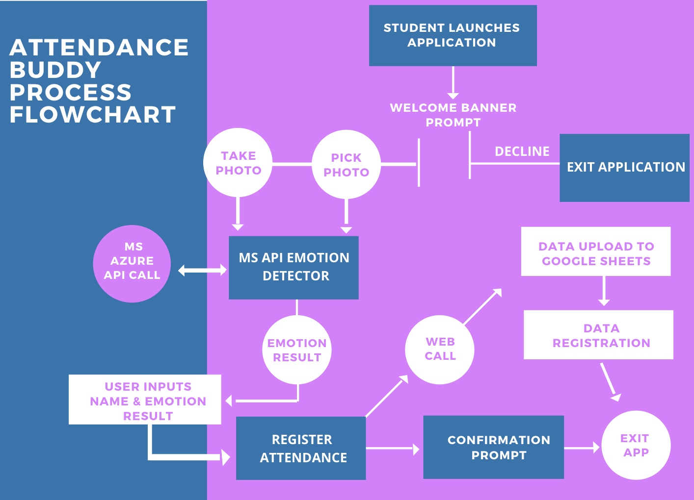
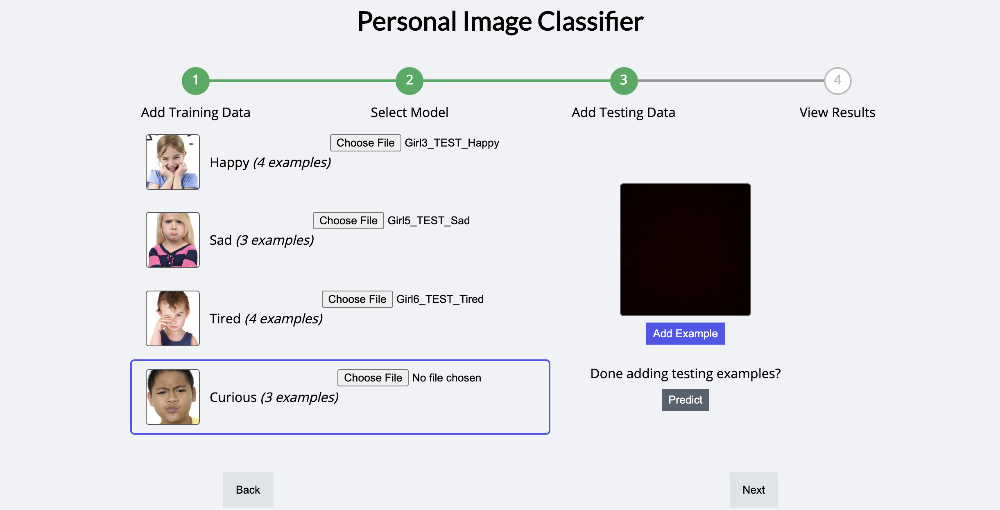

# Design Reflection: Attendance Buddy 


*The following respository contains the design reflection for the CCT461 Speculative Design course at the University of Toronto Mississauga.*

By: Alexandra Dumitras-Geli, Jennifer Palfi, Melanie Zaky, & Nicole Stafferie

---

## The Design Process - Innovating the Way Teachers Take Attendance 


## Objective

Attendancebuddy is an interactive web based application that was developed to aid teachers in the attendance process associated with online learning. The new era of education we’ve entered into comes with it’s own host of challenges. As these challenges arise, we hope to help mitigate them with our app Attendancebuddy. Attendancebuddy focuses on assessing students’ emotion when entering into a lesson, as well as accounting for their attendance. Based on current COVID regulations, as well as other school board regulations, teachers are typically restricted from offering support to students or even making changes to the curriculum on short notice. 


However, Attendancebuddy creates tangible proof of a student's moods and the trends around them to give teachers a reason to change the curriculum or offer the student emotional support. It is important to note that the app doesn’t give immediate emotional support to the student, it acts more as a system to record and track trends of the students’ emotions and then it is the teachers job to offer the support. In order to do this, the app will give instructions to the student to take a photo while expressing the emotion they are feeling before the lesson (excited, sad, angry etc). From here, the app will assess the emotion and feed that information back to the user who will input it into the prompted question following the photo process. After clicking submit, the data will be linked to google sheets from which the teacher will be able to access and analyze the data collectively. Attendance buddy aims to help teachers plan their lessons around students' emotions (which are gaged through the app). By doing so, teachers are able to develop more effective ways of teaching, or engaging with their students because they have direct feedback daily from their students through the app. 


For example, If a teacher is teaching through powerpoints, once they check the app if they see that students are not happy to join class, or are not engaged with the way the lessons are laid out, the teacher can devise a new way to present their lessons. Essentially, Attendancebuddy is not only an accountability app to make sure students are attending classes, but also a feedback method connecting students to teachers.

---

## Document Overview 

- [Background](#Background) 

    - [The Problem](#The-Problem)
    - [Research](#Research) 
    - [Project Direction: Ideation](#Project-Ideation)

- [Prototyping and Validation](#Prototyping-and-Validation)

    - [Limitations](#Limitations) 
    - [Prototype 1](#Prototype-1)
    - [Prototype 2](#Prototype-2) 

- [Postmortem](#Postmortem) 

    - [Evaluation](#Evaluation) 
    - [Conclusion](#Conclusion) 
    - [Future Directions](#Future-Directions)

---

## Background 


## The Problem 

Within any educational institution, attendance is taken to track individual students attending classes. This is crucial for a number of reasons including accountability and safety of the students. Furthermore, although a simple “here” or not indicates if the student is in fact present in the class, it does not provide any information regarding their feelings or satisfaction to actually being there. In light of the COVID-19 pandemic, many students of all ages have been required to learn virtually via Zoom, thus making the relationship between students and teachers extremely compromised. Attendance Buddy provides the opportunity for teachers to gain insight on emotional responses that they would typically gather in person, virtually.  

## Research 

Tracking students’ performance using assignment, testing and grades is efficient yet can also be problematic. More attention should be paid to how the class is making them feel, rather than the grade they are finishing with. Ensuring the attendance of student’s is a mandated task for teachers to complete to monitor the student’s presence and keep accountability. Although, taking attendance can seem as a time-consuming and inefficient means of keeping track of students. 


```
How might we build an app that helps track attendance as well as the emotional state of the student?
```

Educational institutions are always and increasingly more concerned about the consistency of students’ attendance, especially in relation to their student performance (Arjun, Shoheb & Chethan, 2020). Therefore, intelligent attendance systems are at the forefront of making attendance quick, easy and rewarding for both the students and teachers. Using computerized systems in which involve facial recognition, help avoid errors or faulty attendance inputs (Arjun, Shoheb & Chethan, 2020). It uses real time data to identify the student and input the data accordingly (Arjun, Shoheb & Chethan, 2020). Facial recognition is a common and trending intelligence system that is performed through features of extracting data and can help increase productivity (Gunjan, Vinit Kumar., et al, 2020). Taking attendance is a task teacher are no longer required to spend time on due to means of technology. On the other hand, teachers need to be equipped to effectively monitor and ensure the mental security and wellbeing of students (Allen, 2020). Ensuring student satisfaction and enjoying school needs to be a vital aspect of everyday teaching. 

## Project Ideation

### Brainstorming: Our Starting Point 

```
How will we develop new methods to help students manage their emotions and promote emotional well-being in the simplest ways? 
```


### Goal: Create an App that Would... 

**Provide Students:**

- Means of indicating they are present in class that is easy and fast


**Provide Teachers**

- An easy automated information base indicating student’s attendance 
- Data reflecting each student’s mood when completing attendance 
- Gain insight on satisfaction of class that day or scheduling such as time of day or class location 

### Resolution: Attendance Buddy Process Flow



---

## Prototyping and Validation 

## Limitations 

Originally, the design process required a dual application based on the MIT App Inventor "Make Quiz & Take Quiz" skeleton. By applying the logic present in the Make Quiz and Take Quiz application the student would experience a direct user interface and teachers would have access to the backend of the application to gather data on both the student's attendance and registered emotion for the day they logged onto the app. 

In order to develop the emotional well-being deliverable the use of an image classifier extension is required. Due to the limitations in MIT App Inventor, storing image files proved to be an issue. The avialable storage options; cloud DB, tiny DB, Tiny web DB, file etc. do not support image data transfers which would be required in the Make Quiz and Take Quiz application. 

Therefore, we altered the appraoch to provide a consumer (student) facing application. Teachers using the application for attendance and emotion registration would have access to the collected data via a google sheet doc. 


The application would continue to use the Personal Image Classifier extension available in MIT App Inventor. However, this extension **does not** support the *Image Picker* option in the platform. Due to accessbility issues, the emulator was the application testing outlet was the immeidete available outlet. Due to these limitations in MIT App Inventor, the original design process is quite different from the final prototype. In order to provide the MVP (minimum viable product), the design process was updated to use the Microsoft Azure API because it provides the ability to choose images from the local MIT database. 

Please note, if users would like to view the original application created in MIT App Inventor alongside the Personal Image Classifier model view the [Prototype 1 Application] directory. 

## Prototype 1

**Screen 1**

The idea here was to have four separate screens. The first being the check-in, the second was the screen using the personal image classifier algorithm extension. This would be the screen where the student would upload their image or take a picture of themselves. The algorithm would then classify their emotions that we used in the image classifier algorithm. In this screen users would upload an image, and the app would tell them their emotion. Based on that they would click the next button and go into the third screen of the app.


**Screen 2**



In the first prototype, screen 2 would utilize the image classifer model to identify the relevant emotions inputted in the trianing and testing data. 

 

Confirmation screen to confirm that the attendance was recorded and the information was received successfully. Image classifier was the extension used to develop the algorithm- training, testing the data. Uploaded 10 draining pictures- sad, tired, happy, curious, and from there we tested the algorithm- uploaded testing data to see if the algorithm could decipher what the image was. From there, we exported that model and imported another model through the image classifier extension and received an error. The error meant the image classifier extension doesn’t allow us to pick an image from our gallery- not supported. Major problem we encountered. 

**Screen 3**


In this screen, users would type in their name and answer that was seen on the previous screen. They would then submit it, once they press submit it would be connected to google sheets and would register their attendance from there. The app would give them a time-stamp of the day with their name and emotion. 

**Linking Google Docs** 

  

  

## Prototype 2

**Screen 1**

Rather than the original welcome screen, we have a splash screen here that explains what that app is and its functions. 


Screen 1 is the Microsoft Azure API and it has the same functions as the image classifier used before, except you can’t choose the emotions. 

  


Instead, azure picks the emotions for you- since it’s an API. Screen one has the same functionality as the original screen- asking you to select a photo and then scanning the photo to determine the students emotion.

**Screen 2**

  


This page has the same functionality as the original first prototype screen two did. For this screen we had to connect MIT with google sheets in order to be able to store the data that the students would be inputting into the app. 


First, we created google sheets, and created a survey form. From here we took the link from the survey form and we modified the end of the link changing the extension of the link to a CSV. A CSV is readable through MIT. From here we went back into the form we created in Google sheets, and changed the questions to ‘short answer’ questions and put x and y as responses. We again took the link and inputted that into the code. This was important to do to test that the two were connected and receiving answers from one another. 

**Screen 3**

This screen was simply to make sure that the data was received and the student can exit the app.


---

## Postmortem 


## Evaluation 

Through these unprecedented times, where face to face interactions have been completely limited, it is important to ensure academic interactions are still present. This means interactions between teachers and their students in order to ensure optimal academic performance by both the educator and the learner. For instance, a student’s status of emotion can greatly impact their willingness to learn and be diligent within their academia. Thus, it is the educators responsibility to develop methods which make it simpler for students to learn in relation to their emotional standpoint. But, with no face to face interactions, that can be hard to be implemented. Therefore, Attendancebuddy makes this possible. Through the use of this app, students are able to upload or take a picture of their face every school morning. Not only will this give the teacher insight on how the student is feeling that day, but it will be used for attendance purposes. 
Through an on-going evaluation of the students’ daily emotions, the teacher can begin to develop teaching methods and lessons that will best suit the needs of the students. 

While the initial prototype was a bit more advanced than our final prototype, it was due to the limitations encountered while using App Inventor. The way the app operates is that when the students access the app, they are able to take or upload a photo of themselves. The Microsoft Azur API provides the student with feedback in regards to their emotional status. The student can then progress to the next screen of the application and input their name, emotion that they received from the algorithm and through an extension connecting to Google Sheets, the Google Sheets document can register the student’s attendance, as well as, the document their emotion. Google Sheets is very useful as it can be easily accessible by the teachers and the data can be easily transformed into a visualization. Essentially, the Google Sheets are the backbone of this application as it provides teachers with the ability to monitor their student’s emotions, figure out if they need to change anything about their curriculum or if what they’re doing is working. The Google Sheets also function as proof when it comes to teachers needing to change their curriculum, which isn’t necessarily an easy process. Teachers essentially have a backlog where they are able to display the data to their bosses, or even ministry of education in order to validate this change in curriculum. 


Moving into the future, this app has the potential to expand in functionality. Through advancement, we hope that the application can continue to use this data analytics system but then also be able provide teachers with suggestions and recommendations on how the curriculum can be changed. Since this app is currently in a prototyping phase, we would eventually be required to select different platforms to redevelop this app on, which would allow us to increase the scope and functionality of the application. By doing so, the application can progress from the prototyping stage and become an actual app that can be used in classrooms on a daily basis. Although the current prototype is not large in scope, it entails the important concept of what the algorithm aims to achieve through image classification and emotion detection. 

## Conclusion 

Essentially, it was our main priority to demonstrate the importance of developing a model that can be used to predict the emotions as well as the well-being of the user through image classification. While app inventor unfortunately ecompassees limitations that take away from the functionality and overall scope of the prototype we have developed, it is important to highlight the overall concept, purpose and benefit of the app. In a short recap, Attendance Buddy functions as an attendance app that is intended for teachers to monitor the emotions of their students and how they are feeling at the beginning of the day. This app is especially beneficial during this COVID19 pandemic, as there has been a great increase in online learning and students tend to be quite secluded, which can be discouraging when it comes to their motivation to learn. 


When students are not receiving the engagement they need, it can take away from their classroom experience. To try and mitigate this issue, Attendance Buddy allows students to take a photo of themselves, where they then receive feedback of their current emotion status. Emotions can range from sad, tired, bored, happy, etc. The students’ results also fulfill their attendance registration. Through on-going monitoring, teachers have the ability to use these data analytics to keep track of their students’ emotions. For instance, if a teacher finds that for a month straight, 60% of the students are feeling sad, the teacher can then accordingly adjust the curriculum in a way that will generate a happier atmosphere for the students. Curriculum adjustments can include things such as starting off the class with watching a funny video, or doing morning stretches. This will aim to attract students’ attention, increase engagement and boost the overall moral within the classroom. 

## Future Directions 


Once the chatbot has gone through a customer testing period to make sure that it adhered to all the customer’s needs and is effective in detecting the emotions of the user, as well as marking attendance, we would be looking to expand the app to all mobile platforms to make it more accessible to students and teachers. In addition, we would like to fully integrate google sheets (which is the data recording method for the app) into the teacher side of the app, making the students’ data accessible from the teachers mobile device. Lastly, we would also want to add prompts and potential ‘pop-up’ tips for teachers based on trends seen with their students emotions. For example, if there is a trend in the students recording negative emotions before entering lessons, our app could offer helpful prompts to teachers on what potential changes they could make to their lessons to engage their students more.

---

## References 

References documentation can be found in [here](CCT461_References.docx). To review the document select the here option, then view raw. The references document will be downloaded to the users local drive.


